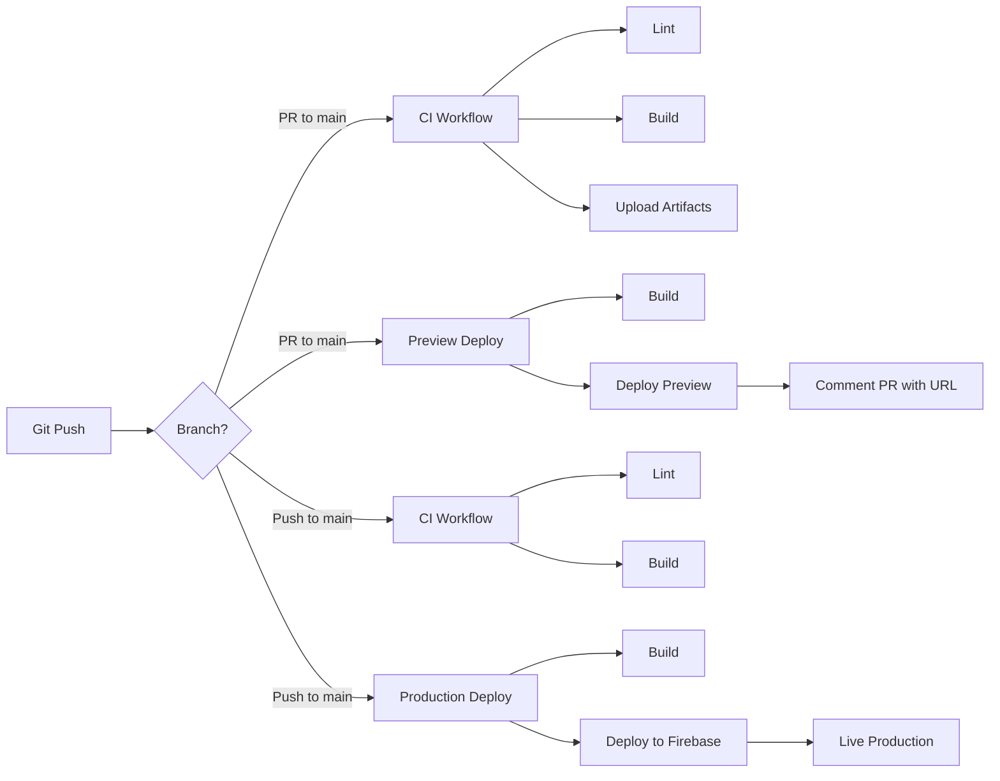

# CI/CD Pipeline - StockApp

## 🔄 Arquitectura del Pipeline



---

## 🚦 Workflows

### 1. CI (Continuous Integration)

**Archivo:** `.github/workflows/ci.yml`

**Triggers:**
- Pull requests a `main` o `master`
- Push a `main` o `master`

**Jobs:**
- Lint del código con ESLint
- Build del proyecto con Quasar
- Testing en múltiples versiones de Node.js (14.x, 16.x)
- Upload de build artifacts

**Estado esperado:** ✅ Debe pasar antes de merge

---

### 2. Deploy a Producción

**Archivo:** `.github/workflows/deploy.yml`

**Triggers:**
- Solo push directo a `main` o `master` (después de merge)

**Jobs:**
- Build del proyecto
- Deploy a Firebase Hosting (producción)
- URL: `https://stock-kipreos.web.app`

**Estado esperado:** ✅ Deploy automático a producción

---

### 3. Preview Deployments

**Archivo:** `.github/workflows/preview.yml`

**Triggers:**
- Pull requests a `main` o `master`

**Jobs:**
- Build del proyecto
- Deploy a Firebase Hosting preview channel
- Comentario automático en PR con URL de preview

**URL generada:** `https://stock-kipreos--pr-[NUMBER]-[HASH].web.app`

**Beneficios:**
- Probar cambios antes de merge
- QA testing en ambiente real
- Compartir preview con stakeholders

---

## 🔧 Configuración Requerida

### GitHub Secrets

El pipeline requiere el siguiente secret configurado:

| Secret Name | Description | How to Get |
|-------------|-------------|------------|
| `FIREBASE_SERVICE_ACCOUNT_STOCK_KIPREOS` | Service account de Firebase | Ver `DEPLOYMENT_GUIDE.md` |

### Variables de Entorno

Los workflows usan las siguientes variables:

- `projectId: stock-kipreos` (hardcoded en workflows)
- `GITHUB_TOKEN` (automático por GitHub)

---

## 📊 Estado de los Workflows

### Badges

Agrega estos badges a tu README.md:

```markdown


```

---

## 🎯 Flujo de Trabajo Recomendado

### Feature Development

```bash
# 1. Crear rama de feature
git checkout -b feature/nueva-funcionalidad

# 2. Desarrollar
npm run dev

# 3. Lint y fix
npm run lint:fix

# 4. Commit
git add .
git commit -m "feat: descripción del cambio"

# 5. Push
git push origin feature/nueva-funcionalidad

# 6. Crear PR en GitHub
# - CI workflow se ejecuta automáticamente
# - Preview deployment se crea automáticamente
# - Revisa los checks antes de merge
```

### Hotfix

```bash
# 1. Crear rama de hotfix desde main
git checkout main
git pull origin main
git checkout -b hotfix/fix-critical-bug

# 2. Fix rápido
# ... código ...

# 3. Commit y push
git add .
git commit -m "fix: critical bug description"
git push origin hotfix/fix-critical-bug

# 4. PR con revisión rápida
# 5. Merge y deploy automático
```

---

## 🔍 Monitoreo del Pipeline

### GitHub Actions UI

1. Ve a tu repositorio en GitHub
2. Click en la pestaña **Actions**
3. Verás todos los workflow runs

### Ver logs de un run específico:

1. Click en el run que quieres inspeccionar
2. Click en el job específico
3. Expande los steps para ver logs detallados

### Cancelar un run:

1. Ve al run en ejecución
2. Click en **Cancel workflow**

### Re-ejecutar un run fallido:

1. Ve al run fallido
2. Click en **Re-run jobs**
3. Selecciona **Re-run failed jobs** o **Re-run all jobs**

---

## 🚨 Troubleshooting

### ❌ Workflow falla en "Install dependencies"

**Causa:** `package-lock.json` no está sincronizado

**Solución:**
```bash
rm package-lock.json
npm install
git add package-lock.json
git commit -m "fix: update package-lock.json"
git push
```

### ❌ Workflow falla en "Run ESLint"

**Causa:** Errores de linting

**Solución:**
```bash
npm run lint:fix
git add .
git commit -m "fix: lint errors"
git push
```

### ❌ Deploy falla con "Authentication error"

**Causa:** Service account secret no configurado o inválido

**Solución:**
1. Regenera el service account en Firebase Console
2. Actualiza el secret en GitHub Settings
3. Re-ejecuta el workflow

### ❌ Preview deployment no comenta en PR

**Causa:** Permisos insuficientes del GITHUB_TOKEN

**Solución:**
1. Ve a Settings → Actions → General
2. En "Workflow permissions", selecciona "Read and write permissions"
3. Save

---

## 📈 Mejoras Futuras

### Posibles adiciones al pipeline:

- [ ] Tests unitarios con Jest
- [ ] Tests E2E con Cypress
- [ ] Lighthouse CI para performance
- [ ] Security scanning con Snyk
- [ ] Dependency updates con Dependabot
- [ ] Semantic versioning automático
- [ ] Changelog automático
- [ ] Notificaciones a Slack/Discord

### Template para agregar tests:

```yaml
# .github/workflows/ci.yml
- name: Run unit tests
  run: npm run test:unit

- name: Run E2E tests
  run: npm run test:e2e
```

---

## 📚 Recursos

- [GitHub Actions Syntax](https://docs.github.com/en/actions/using-workflows/workflow-syntax-for-github-actions)
- [Firebase Hosting Action](https://github.com/marketplace/actions/deploy-to-firebase-hosting)
- [Quasar CLI Testing](https://quasar.dev/quasar-cli/testing-and-auditing)

---

**Mantenido por:** Gonzalo Fleming
**Última actualización:** 2025-11-17
